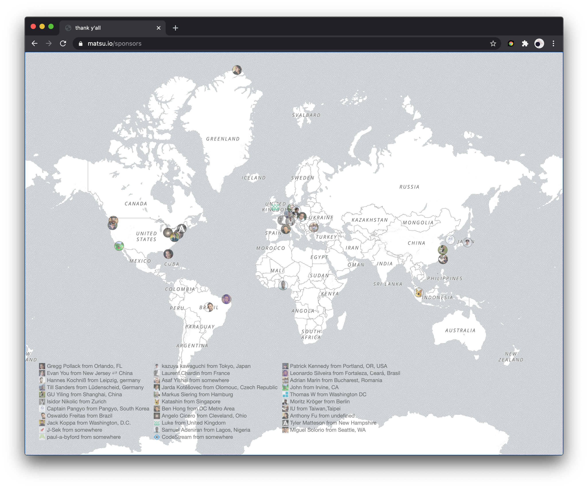

  <h2 align="center">Sponsors Map</h2>

  <i>thank y'all, <a href="https://matsu.io/sponsors">my sponsors</a></i>

### How this works

- A [GitHub action](.github/workflows/sponsors.yml) runs every day to:
  - Pull my sponsors with [GitHub GraphQL API](https://docs.github.com/en/graphql)
  - Use [Mapbox Geocoding API](https://docs.mapbox.com/api/search/#geocoding) to find sponsors' location coordinates
  - Save the data into a [TS file](src/sponsorsWithGeo.ts)
- Map sponsors on a map with Mapbox
- Publish the site with Netlify 

### Make it yours

- Fork it
- Get a [Mapbox token](https://docs.mapbox.com/help/how-mapbox-works/access-tokens/)
  - Add it as `MAPBOX_KEY` in repo's Settings -> Secrets
  - Replace the `mapboxgl.accessToken` in [`src/index.ts`](src/index.ts)
- Remove the last few steps in `.github/workflows/sponsors.yml`, which pushes the built output to octref/matsu, the repo behind https://matsu.io

### Boring stuff

MIT © [Pine Wu](https://github.com/octref)